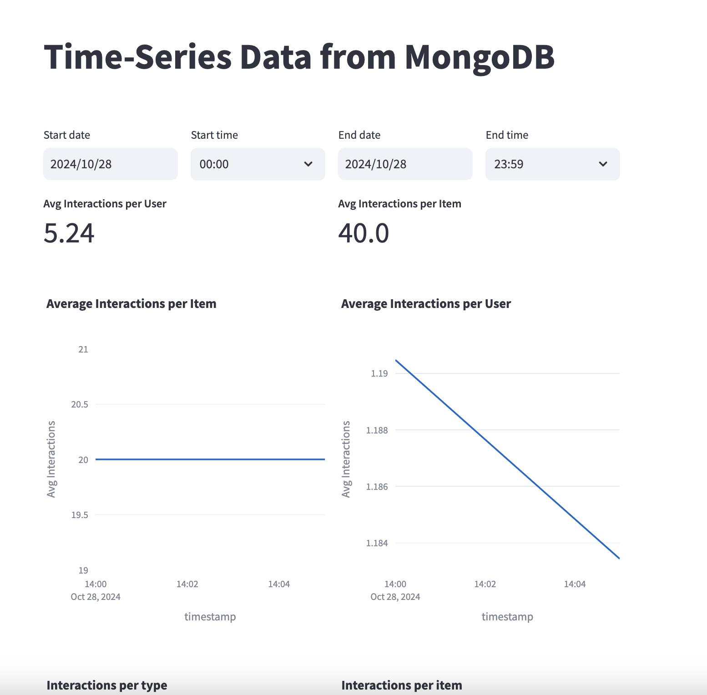

# Real-Time Data Generator, Aggregator, Storage, Visualization

This project is split into 3 modules: generator, aggregator, and visualization. To serve those modules, there are some infra tools that I use. All of the explanations are in the next sections.

## Running Modules as A Whole

All modules have been configured in 3 Docker compose files. Here's a command to start them:

```shell
# This will trigger the data generator too.
docker-compose -f docker-compose-infra.yaml -f docker-compose-app.yaml up --build -d

# This will only run Spark jobs for services you specify here. If you want to start all, don't declare any service names.
# Please beware that running all of the services at once could make them fail due to OOM issue
# If you see any services/containers failed with 137 code, stop all running aggregation services and restart the failing ones
docker-compose -f docker-compose-streaming.yaml up <service1> <service2> --build
```

The list of streaming services is listed here: [aggregator/README.md](./aggregator/README.md).

After the data has been loaded to MongoDB, you can open the dashboard at http://localhost:8501. This is how the dashboard should look like:



## Modules

### Generator

#### Description
The Generator is simple and straightforward. It generates each data point and store it in files. Each batch is stored in a file. So, for example if we want to generate 1000 data points with batch size of 100, there will be 10 files where each file there will be 100 lines of data. This can avoid loading the entire batch into the memory, which although batch is smaller than the entire data, but it could still be huge, depending on the configured size. This module has been tested to generate 1,000,000 records with 100,000 for each batch without getting OOM.

#### Manuals

Please read the [Generator manual](generator/README.md) to get started on the module. The program arguments documentation can also be found there.

### Aggregator

#### Description
I made the aggregator to be flexible and extendable by making each aggregation pipeline reads from an SQL file. With this design, adding new aggregation pipelines is as easy as writing SQL files (with some exception, but still should be quite easy). Backfilling the sink table after modifying an SQL query is also easy, as it automatically reads the Kafka topic from the beginning if it detects changes in the SQL file. I go with this design because I know the high value of capability in self-service data pipeline in modern data platforms, so everyone (not only data engineers) can make their real-time data pipeline.

#### Manuals

Please read the [Aggregator manual](aggregator/README.md) to get started on the module. The program arguments documentation can also be found there.

### Visualization

#### Description
I pick Streamlit as it's simple and easy to package, because the dashboards are written as Python file. Although it's simple, it has potential for scalability, as it's similar to any web applications, it's as scalable as we make it to be. For example, we can use replications, horizontal scaling, and load balancers as Streamlit is stateless. However, since the data reading process from source databases are entirely manual, we have to make sure that we read them efficiently (i.e. making use of indices, partitions, or clustering). Streamlit also supports caching to help with this effort.

The weakness of Streamlit in this use case is it doesn't inherently support data threshold alerting, like Kibana or Grafana. However, we could implement an alerting logic in the Python script.

#### Manuals

Please read the [Visualization manual](visualization/README.md) to get started on the module. The program arguments documentation can also be found there.

### Infra: Storage

#### Description
I pick MongoDB as it suits well into this use case. Because most of the heavy aggregations have been done by Spark, the storage layer only needs to store the aggregation results. It also integrates well with Spark and Streamlit. It is also a quite widely used technology, so onboarding people to use it is easy.

However, MongoDB might not be the best solutions if we only do minimal amount processing in Spark, then dumping the unaggregated data into the DB, as the DB needs to process a lot of aggregations when the analytical dashboard reads from it. If this is the case, then DB technologies specifically tailored for real-time analytics might be a better option, such as CLickHouse.

#### Manuals

Starting the MongoDB is simple, we just need to run this command:
```shell
docker-compose -f docker-compose-infra.yaml up -d
```
And the MongoDB instance will be accessible from this address: `localhost:27017`